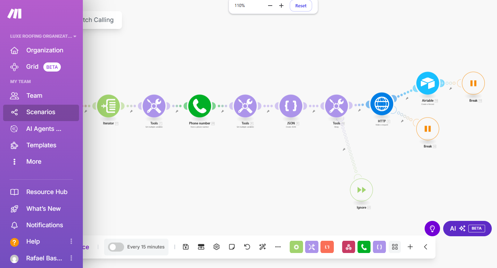
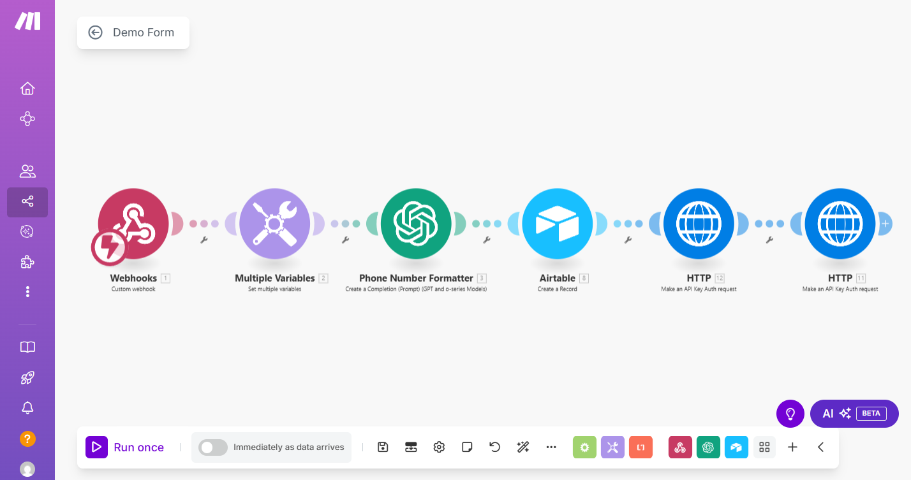

# AI-Receptionist-Outbound-Call

This project is a custom-built AI Voice Assistant designed to automate outbound calls for a roofing company based in Texas. Leveraging **Vapi Voice**, **Make.com**, and **Airtable**, this solution enhances lead engagement and improves response time—especially during high-demand situations like storm damage events.

## 🚀 Project Overview

The AI Voice Assistant system performs two core functions:

1. **Outbound Calling from CSV Lead Data**
    - Automatically reads a list of leads from a CSV file.
    - Initiates outbound calls to each contact using Vapi Voice.
    - Speaks to leads using a dynamic AI-generated script with personalization (e.g., using the lead’s name).
    - Logs call outcomes into Airtable for easy tracking and reporting.

2. **Instant Follow-Up for Website Form Submissions**
    - Triggers a call as soon as a customer fills out a form on the company website.
    - AI voice agent instantly calls the customer to confirm interest or provide further instructions.
    - Helps reduce drop-offs and increases conversion by engaging users at the right moment.

## 🧠 Tech Stack

- **Vapi Voice** – AI-driven voice calling platform with programmable speech.
- **Make.com** – Workflow automation for integrating tools and orchestrating logic.
- **Airtable** – Central database for managing leads, call logs, and responses.
- **CSV Import** – Batch uploads of lead data for bulk calling campaigns.

## 🏗️ Use Case: Roofing Business in Texas

This project was developed for a roofing contractor in Texas. When storms hit the area, the system is deployed to proactively reach out to residents offering **free roofing inspections**. The goal is to help the business connect quickly with affected homeowners and generate more opportunities.

### ✅ Business Outcomes:
- Reduced manual cold-calling.
- Faster response to storm damage inquiries.
- Increased inspection bookings and qualified leads.
- Enhanced customer experience with personalized AI calls.

## 📁 How to Use (Coming Soon)
Instructions for deployment will be added if made public. This version is client-specific and currently customized for internal use.

---

💬 **Feel free to fork, customize, or get in touch if you're building AI-powered voice outreach tools!**
